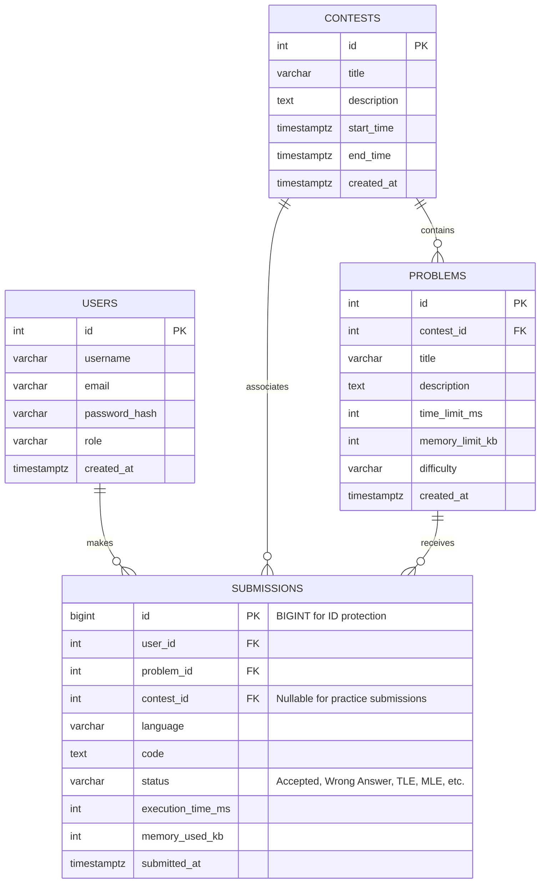

# Heuristic Contest Analytics: Database Architecture & Performance Tuning

An optimized, production-grade PostgreSQL backend architecture designed to handle high-throughput query loads for an online competitive algorithmic judging platform. 

This repository contains database DDL definitions, a high-speed Python mock-data seeding engine, advanced analytical SQL queries (CTEs, Window Functions), and a documented case study in query profiling and compound index tuning.

---

## 1. Database Architecture & Schema Design

The relational database is fully normalized to record user submission histories, contest timelines, problem parameters, and execution performance (time and memory metrics).



### Core Entities:
* **[users](file:///c:/Users/jehad/OneDrive/Desktop/3.2/job/schema.sql#L9-L22)**: Stores user identities, roles (`user`, `moderator`, `admin`), and creation timestamps. Labeled with length and format validation checks.
* **[contests](file:///c:/Users/jehad/OneDrive/Desktop/3.2/job/schema.sql#L28-L40)**: Time-boxed coding events. Enforces `start_time < end_time` validation checks.
* **[problems](file:///c:/Users/jehad/OneDrive/Desktop/3.2/job/schema.sql#L47-L63)**: Individual coding challenges containing time limits (ms) and memory limits (kb). Can belong to a contest or be independent (practice).
* **[submissions](file:///c:/Users/jehad/OneDrive/Desktop/3.2/job/schema.sql#L69-L92)**: High-throughput transaction table capturing submission parameters (`language`, `code`, `status`, `execution_time_ms`, `memory_used_kb`, `submitted_at`). Employs a `BIGSERIAL` primary key to avoid integer id exhaustion.

---

## 2. Advanced SQL Queries

The [queries/](file:///c:/Users/jehad/OneDrive/Desktop/3.2/job/queries/) directory contains production-grade SQL scripts showcasing advanced relational database patterns:

* **[dynamic_leaderboard.sql](file:///c:/Users/jehad/OneDrive/Desktop/3.2/job/queries/dynamic_leaderboard.sql)**: Computes the real-time leaderboard rankings using window functions (`RANK()`, `DENSE_RANK()`). It applies ACM-ICPC rules, counting solved problems and adding a 20-minute penalty for each wrong submission sent prior to the first accepted submission.
* **[problem_difficulty_analyzer.sql](file:///c:/Users/jehad/OneDrive/Desktop/3.2/job/queries/problem_difficulty_analyzer.sql)**: Resolves the hardest problems (lowest pass/acceptance rate) that also demand the highest execution times. Uses multiple CTEs, rankings, and a calculated composite score to identify mismatches between empirical difficulty and metadata labels.
* **[user_progression.sql](file:///c:/Users/jehad/OneDrive/Desktop/3.2/job/queries/user_progression.sql)**: Tracks a user's month-over-month memory efficiency improvements for accepted solutions using the `LAG()` window function.

---

## 3. Performance Tuning & Optimization Highlight

We profiled and optimized the dynamic leaderboard query, resolving a critical database bottleneck under concurrent user traffic. Full execution details and plans are documented in the [OPTIMIZATION_CASE_STUDY.md](file:///c:/Users/jehad/OneDrive/Desktop/3.2/job/OPTIMIZATION_CASE_STUDY.md).

### Summary of Tuning Results:
* **The Bottleneck**: An initial leaderboard query utilizing an N+1 model (nested loops of correlated subqueries in the SELECT clause) coupled with non-sargable filtering (`COALESCE(contest_id, 0) = 4`) forced PostgreSQL to scan the heap. This resulted in an execution time of **`22,041.36 ms`** and **`1,419,013` cache page hits** (about 11 GB of read volume).
* **The Solution**: 
  1. Rewrote the query to be completely **set-based**, grouping aggregates globally and resolving them using Hash Right/Left Joins.
  2. Applied a compound covering index:
     ```sql
     CREATE INDEX IF NOT EXISTS idx_submissions_leaderboard_optimized 
     ON submissions(contest_id, status, user_id, problem_id, submitted_at);
     ```
* **The Result**: PostgreSQL optimized the query path to perform **Index Only Scans** with **0 Heap Fetches**, dropping execution time to **`26.94 ms`** (an **819.6x speedup**) and reducing page reads to just **`222` blocks** (a **6,391.9x reduction**).

---

## 4. Local Execution & Verification

### Prerequisites
* **Database**: PostgreSQL (v14+ recommended) with the `uuid-ossp` extension.
* **Runtime**: Python 3.8+

### Setup Instructions

1. **Install Dependencies**:
   Install database driver and mock-data faker utilities:
   ```bash
   pip install psycopg2-binary faker
   ```

2. **Configure Database Connection**:
   Update your database credentials at the top of [generate_data.py](file:///c:/Users/jehad/OneDrive/Desktop/3.2/job/generate_data.py#L12-L17):
   ```python
   DB_HOST = "localhost"
   DB_PORT = 5432
   DB_USER = "postgres"
   DB_PASS = "YOUR_PASSWORD"
   DB_NAME = "algo_contest"
   ```

3. **Initialize and Seed Database**:
   Run the seeding script. It will automatically create the `algo_contest` database, build the tables and base indexes defined in `schema.sql`, generate and bulk load **5,000 users**, **20 contests**, **100 problems**, and **250,000 submissions** (using the high-performance PostgreSQL `COPY` protocol in batches), and run database analysis:
   ```bash
   python generate_data.py
   ```

4. **Run Analytics Queries**:
   You can run the query scripts inside [queries/](file:///c:/Users/jehad/OneDrive/Desktop/3.2/job/queries/) using any database client (e.g. pgAdmin, DBeaver, or `psql`). For example, to run the progression tracker using the command line:
   ```bash
   psql -h localhost -U postgres -d algo_contest -f queries/user_progression.sql
   ```
